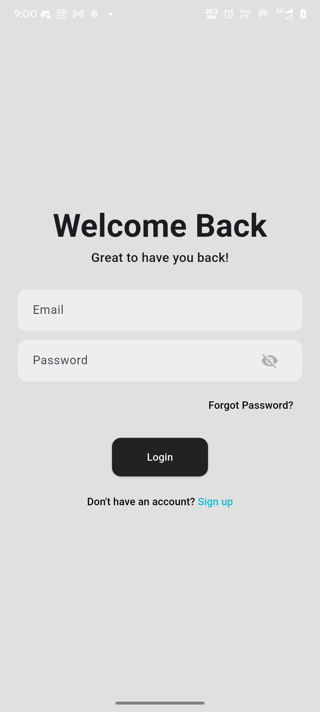
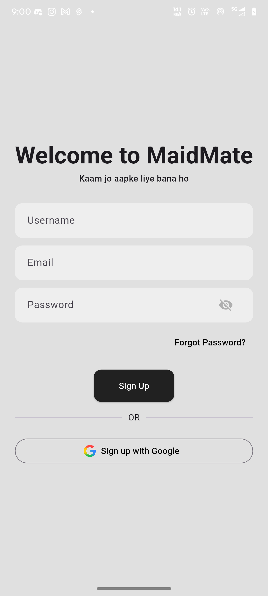
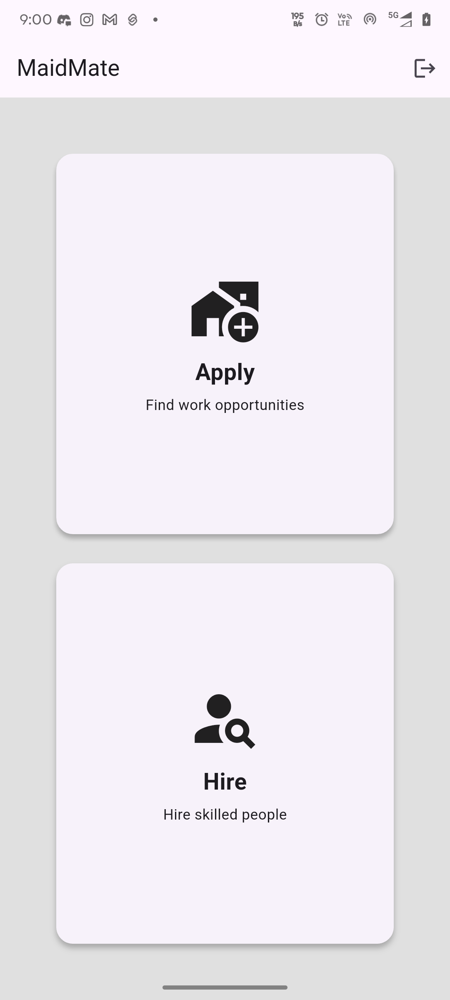
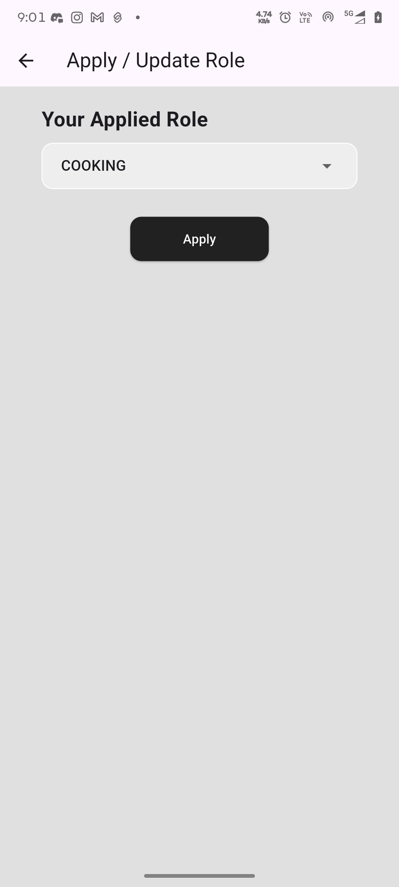

# MaidMate App 🧹

---

## 📌 About the Project

MaidMate is a Flutter-based mobile application that connects users with reliable household service providers such as cleaning, cooking, and maintenance. The app simplifies service booking with a smooth and user-friendly experience.

---

## 📱 Download APK
👉 [Download App](https://drive.google.com/file/d/1vsO41r0DbMCqDhi9iu53ZRZLTKuSyuwq/view?usp=sharing)

---

## 🚀 Features
- 🔍 Browse and select household services easily  
- 📅 Book services with a simple and intuitive interface  
- 🔐 User authentication system  
- ⚡ Fast and responsive performance  
- 📱 Clean and modern UI design  

---

## 📸 Screenshots

### Splash Screen

### Login Page

### Sign Up Page

### Home Page

### Hire Page

### Apply Page

---

## 🛠 Tech Stack
- Flutter  
- Dart  
- Firebase  

---

## 📂 Project Structure
- `lib/` → Main application logic  
- `assets/` → Images and UI resources  

---

## 👨‍💻 Developer
**Mohit Singh Karki**
